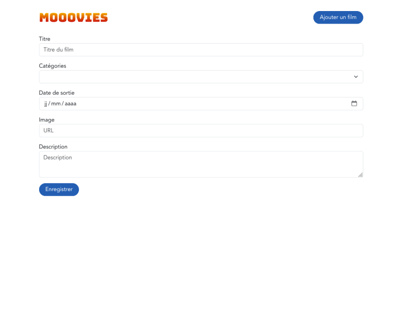
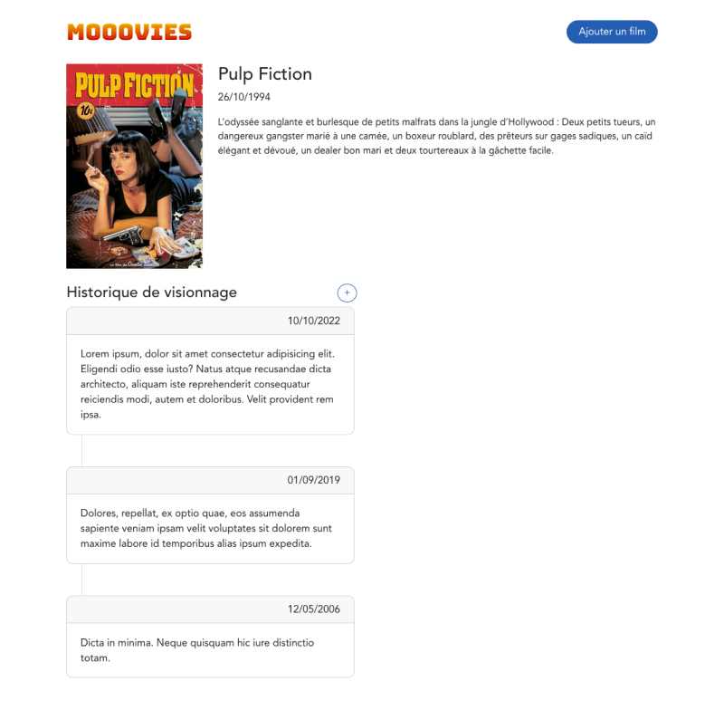
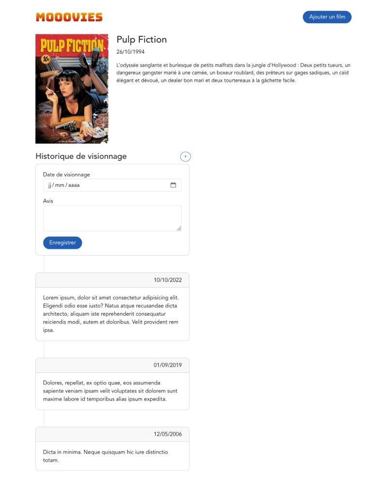

# Mooovies

## Présentation

Mooovies est un projet factice qui permet de tester les compétences des développeurs.

Le concept de l'application est très simple : il s'agit d'un outil qui permet de lister les films que l'on a dans sa collection.

Pour des raisons de simplicité, il n'y a pas de système de connexion ou d'authentification.

Ce monorepo possède 2 dossiers :
- api : pour le backend (avec Laravel)
- web-app : pour le frontend (avec Vue)

## Installation

### API

Prérequis : php 8.1 + mysql + composer installé

Étapes :
- dans le dossier "api"
- dupliquer le fichier `.env.example` en `.env` et y rentrer sa configuration (BDD notamment)
- lancer `composer install` pour installer les vendors
- lancer `php artisan migrate` pour installer la BDD (cette commande propose de créer la base de données si elle n’existe pas)
- lancer `php artisan db:seed` pour remplir sa BDD avec quelques données fictives
- configurer son fichier host en ajoutant une ligne : `127.0.0.1 api.mooovies.local`
- configurer un vhost en `api.mooovies.local` qui pointe vers le dossier `public` du projet Laravel

### Web App

Prérequis : node installé

Étapes :
- dans le dossier "web-app"
- lancer `npm install` pour installer les modules
- dupliquer le fichier `.env.example` en `.env` et y modifier sa configuration si nécessaire
- une fois installé, lancer `npm run dev` pour coder

## Exercices

### Feature n°1

Créer le formulaire d'ajout de film, et ajouter un champ "catégories" sur les films.

Ce formulaire doit permettre d'ajouter un film dans la base de données et d'y associer une ou plusieurs catégories.

Par simplicité, l'image du film est une url vers une image et non un upload de fichier. On peut utiliser les images de [themoviedb.org](https://www.themoviedb.org).

Voilà à quoi peut ressembler le formulaire :

### Feature n°2

Avoir un historique de ses visionnages sur chaque film.

L'idée est de pouvoir renseigner quand on a vu un film, et donner son avis. On peut renseigner plusieurs avis (car on peut voir le film plusieurs fois, et avoir un avis qui évolue).

Voilà à quoi peux ressembler la timeline :

Et la timeline avec le formulaire d'ajout d'avis :

